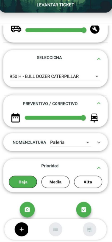
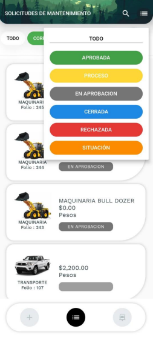
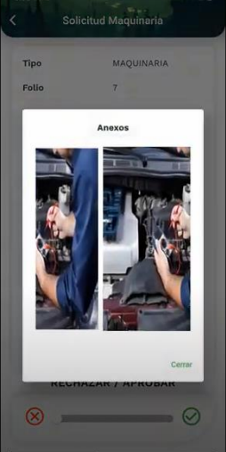
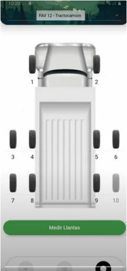

## CONTROL DE MANTENIMIENTO A EQUIPOS DE TRANSPORTE
Gestiona las solicitudes, autorización y operación de 
lo smantenimientos preventivos y correctivos de tus
vehículos desde la APP

La información viajara al ERP registrando y dando
seguimiento a las ordenes y actualizando los gastos y
el costo del activo así como el calendario de los
mantenimientos programados

 

## CONTRÒL DE LLANTAS

### `npm start`

Runs the app in the development mode. 
Open [http://localhost:3000](http://localhost:3000) to view it in the browser.